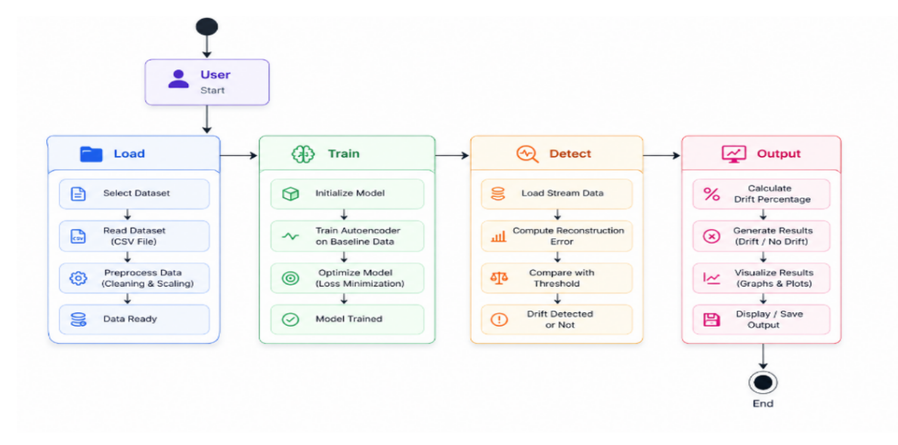
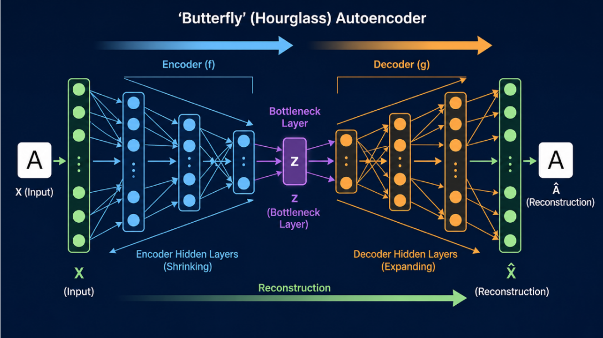
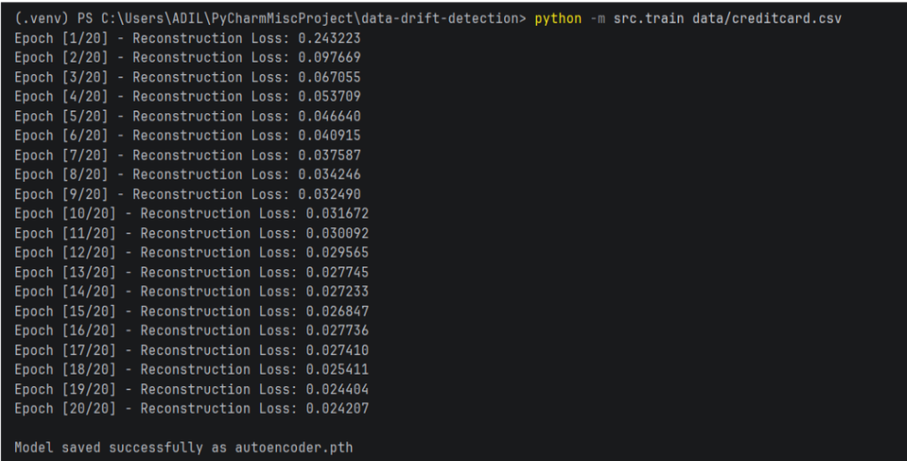

# 🧠 Deep Autoencoder for Unsupervised Data Drift Detection

A deep learning-based system for detecting **data drift** in machine learning pipelines using **Deep Autoencoders**. The model learns the normal characteristics of baseline data and identifies distribution shifts by analyzing reconstruction error, enabling early detection of performance degradation without requiring labeled data.

---

## 📌 Overview

Machine learning models assume that future data follows the same distribution as the data used during training. In real-world applications, however, data distributions change over time due to evolving user behavior, environmental conditions, or operational changes. This phenomenon is known as **data drift** and can significantly reduce model performance.

This project presents an **unsupervised drift detection system** built with PyTorch that learns normal data patterns using a deep autoencoder. Incoming data is reconstructed by the trained model, and reconstruction error is monitored to detect deviations from the learned baseline.

The system was evaluated on multiple real-world datasets, demonstrating its ability to identify both sudden and gradual drift across different domains.

---

## ✨ Features

- Deep Autoencoder implemented using **PyTorch**
- Fully **unsupervised** drift detection
- Dataset-independent preprocessing pipeline
- Reconstruction error-based drift detection
- Automatic threshold generation using the **95th percentile**
- Supports multiple structured datasets
- Visualizes reconstruction error and detected drift
- Modular and easy-to-extend project structure

---

## 🔄 System Workflow

<p align="center">
  
</p>

The workflow begins with data preprocessing and normalization, followed by splitting the dataset into baseline and stream data. The autoencoder is trained using baseline data to learn normal behavior. Incoming stream data is reconstructed by the trained model, and reconstruction error is calculated for every sample. A threshold based on the 95th percentile of baseline reconstruction error is then used to identify potential drift.

---

## 🏗 Deep Autoencoder Architecture

<p align="center">
  
</p>

The autoencoder compresses input data into a lower-dimensional latent representation and reconstructs it back to its original form. Since the model is trained only on baseline data, it reconstructs familiar patterns accurately while producing higher reconstruction errors for data that differs significantly from the learned distribution.

---

## 📊 Experimental Results

### Training Performance

<p align="center">
  
</p>

The reconstruction loss decreases consistently during training, indicating that the model successfully learns the underlying characteristics of the baseline dataset.

---

### Credit Card Dataset

<p align="center">
  
</p>

The model successfully identifies abrupt increases in reconstruction error, highlighting significant distribution changes in transaction data.

---

### Forest Cover Type Dataset

<p align="center">
  
</p>

Evaluation on the Covtype dataset demonstrates that the proposed approach generalizes well beyond financial data and remains effective for environmental datasets.

---

### Electricity Load Dataset

<p align="center">
  
</p>

Unlike sudden spikes observed in structured datasets, the electricity dataset exhibits gradual drift over time. The increasing reconstruction error illustrates the model's capability to detect slowly evolving distribution shifts.

---

## 📂 Project Structure

```text
Deep-Autoencoder-Data-Drift-Detection
│
├── images/
├── src/
│   ├── autoencoder.py
│   ├── data_loader.py
│   ├── train.py
│   ├── detect_drift.py
│   └── drift_simulation.py
│
├── README.md
├── requirements.txt
├── LICENSE
└── .gitignore
```

---

## 🛠 Tech Stack

- Python
- PyTorch
- NumPy
- Pandas
- Scikit-learn
- Matplotlib

---

## 🚀 Installation

Clone the repository

```bash
git clone https://github.com/yourusername/deep-autoencoder-data-drift-detection.git
```

Install dependencies

```bash
pip install -r requirements.txt
```

---

## ▶️ Usage

Train the model

```bash
python -m src.train path/to/dataset.csv
```

Run drift detection

```bash
python -m src.detect_drift path/to/dataset.csv
```

---

## 📁 Datasets

The project was evaluated using publicly available datasets:

- Credit Card Fraud Detection Dataset
- Forest Cover Type Dataset (Covtype)
- Electricity Load Diagrams 2011–2014 Dataset

Due to dataset size and licensing considerations, datasets are **not included** in this repository. Please download them from their official sources before running the project.

---

## 🔮 Future Improvements

- Feature-level drift localization
- Adaptive threshold selection
- Online drift detection
- Automatic model retraining
- Integration with MLOps monitoring pipelines

---

## 📄 License

This project is released under the MIT License.
